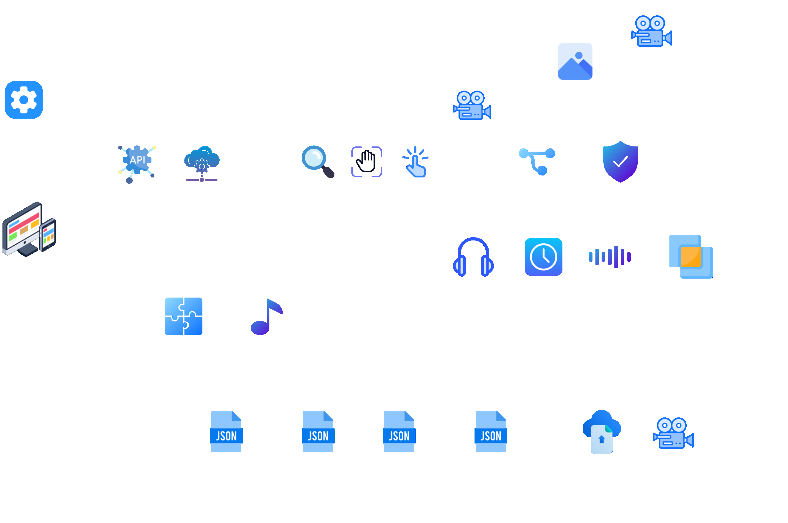

# Myanmar Harp String & Note Detection

An end-to-end computer vision and audio analysis system for transforming **Myanmar saung-gauk harp performances** into traceable string-touch events, strike decisions, annotated video, and note-oriented review data.



## Why This Project Stands Out

Traditional harp performance analysis is difficult because visual contact, string vibration, and audible onset do not always happen at exactly the same frame. This project approaches the problem as a full analysis pipeline rather than a single-model prediction:

- **Frontend review workspace** for upload, processing status, annotated playback, event timelines, and generated note slots.
- **FastAPI inference backend** for video upload, job tracking, cached responses, and generated artifacts.
- **Computer vision pipeline** using YOLO-style harp/string detection, OpenCV video processing, and MediaPipe hand landmarks.
- **Audio-informed decision layer** using onset and pitch evidence to support visual strike decisions.
- **Traceable outputs** including touch-event JSON, strike-event JSON, AV fusion results, debug reports, annotated video, and beat-aligned slot summaries.

## Architecture

The system is split into clear layers:

| Layer | Responsibility |
| --- | --- |
| React + Vite frontend | Upload videos, show progress, review annotated output, inspect event timelines |
| FastAPI backend | Accept uploads, manage jobs, serve predictions and generated files |
| Video touch extraction | Detect harp geometry, track hands, map fingertips to strings |
| Strike inference | Estimate whether visual contact caused string vibration |
| Audio inference | Align onset and pitch evidence with touch events |
| AV fusion | Merge visual and audio signals into final decisions |
| Data stores | Keep uploaded videos, annotated videos, JSON artifacts, and debug reports |

## Repository Layout

```text
.
|-- backend/                         # FastAPI app, prediction endpoints, post-processing
|-- configs/                         # Pipeline configuration
|-- hand-detection/                  # MediaPipe / RTMPose hand detection experiments
|-- harp_pose_v11m_prepped/          # Model package location; weights are ignored
|-- myanma-saung-main/               # React + Vite + Tailwind frontend
|-- saung_strike_video_farneback_rules/
|   |-- src/                         # Optical-flow vibration and rule engine modules
|   `-- tests/                       # Rule-engine tests
|-- scripts/                         # Offline analysis and visualization helpers
|-- src/                             # Shared audio, video, fusion, pipeline, and IO modules
|-- docker-compose.yml               # Backend/frontend local orchestration
`-- PIPELINE_DOCUMENTATION.md        # Deeper pipeline notes
```

## Features

- Upload MP4/MOV/WEBM performance clips.
- Run fast or accurate analysis profiles.
- Detect string geometry and fingertip touch candidates.
- Infer struck strings using video motion and rule-based filtering.
- Fuse visual evidence with audio onset/pitch evidence.
- Generate annotated playback for review.
- Persist JSON artifacts for reproducibility and debugging.
- Display beat-aligned on/off slot summaries for note review.
- Keep expensive runs cacheable for repeat experiments.

## Tech Stack

| Area | Tools |
| --- | --- |
| Frontend | React, TypeScript, Vite, Tailwind CSS, lucide-react |
| API | FastAPI, Uvicorn, python-multipart |
| Vision | OpenCV, Ultralytics, MediaPipe |
| Audio | librosa, soundfile |
| Data | JSON/JSONL artifacts, cached prediction payloads |
| DevOps | Docker Compose, npm, Python requirements |

## Quick Start

### 1. Install dependencies

```bash
# Python backend dependencies
pip install -r requirements.txt
pip install -r backend/requirements.txt

# Frontend dependencies
cd myanma-saung-main
npm install
```

### 2. Restore model weights

Model weights are intentionally excluded from Git. Place the trained detector at:

```text
harp_pose_v11m_prepped/weights/best.pt
```

### 3. Start the backend

```bash
cd backend
python -m uvicorn app:app --host 127.0.0.1 --port 8000
```

Health check:

```bash
curl http://127.0.0.1:8000/health
```

### 4. Start the frontend

```bash
cd myanma-saung-main
npm run dev
```

Open:

```text
http://localhost:8080
```

## Docker Option

```bash
docker compose up --build
```

The compose setup starts:

- Backend API on `http://localhost:8000`
- Frontend dev server on `http://localhost:5173`

## Vercel Deployment

This repository includes a root `vercel.json` so Vercel can deploy the frontend from the `myanma-saung-main` subfolder while keeping the monorepo layout intact.

Recommended Vercel project settings:

| Setting | Value |
| --- | --- |
| Framework preset | Vite |
| Install command | `cd myanma-saung-main && npm ci` |
| Build command | `cd myanma-saung-main && npm run build` |
| Output directory | `myanma-saung-main/dist` |

Add this environment variable in Vercel if the analyzer should call a deployed backend:

```text
VITE_API_BASE_URL=https://your-fastapi-backend.example.com
```

The Vercel deployment is for the React frontend. The FastAPI inference backend uses OpenCV, MediaPipe, Ultralytics, model weights, and generated video artifacts, so it should be deployed separately on a Python-friendly host such as Render, Railway, Fly.io, a VPS, or a GPU/CPU server. Point `VITE_API_BASE_URL` to that backend URL.

If you choose `myanma-saung-main` as the Vercel Root Directory instead of the repository root, the frontend folder also contains its own `vercel.json` with equivalent Vite SPA settings.

## Important Git Notes

The repository intentionally ignores:

- `node_modules/`
- frontend `dist/`
- uploaded videos
- generated annotated videos
- backend caches and debug reports
- model weights such as `.pt`, `.pth`, `.onnx`
- experiment output folders

This keeps the repository lightweight, reviewable, and safe for GitHub.

## Verification Commands

```bash
# Frontend production build
cd myanma-saung-main
npm run build

# Backend health
curl http://127.0.0.1:8000/health

# Rule-engine tests, when dependencies are installed
pytest saung_strike_video_farneback_rules/tests
```

## Project Status

The current implementation supports local research workflows, visual/audio fusion experiments, annotated video review, and JSON artifact generation. The next natural improvements are model-weight release packaging, batch-evaluation dashboards, and a calibrated benchmark dataset for string-level accuracy reporting.

## Credits

Built as a Data Analysis and Management project focused on Myanmar harp string detection, audio-visual strike inference, and explainable note review.
